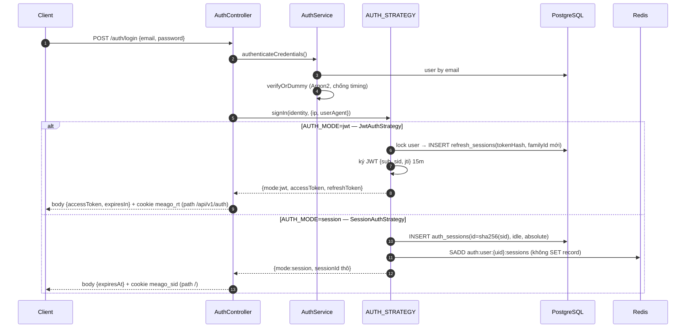
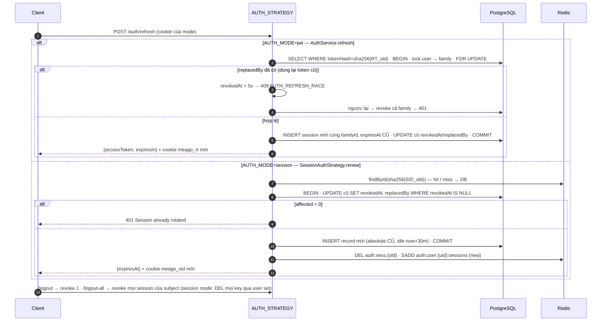
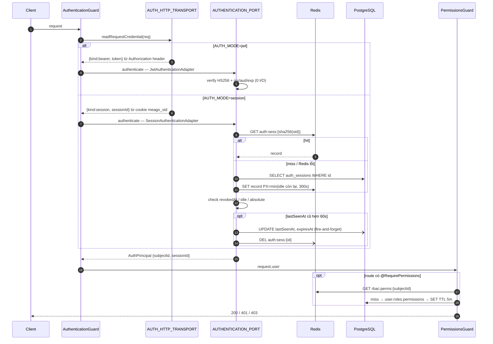

# Authentication: JWT và stateful session

## Boundary chung

Application và authorization chỉ nhận `AuthPrincipal`. Guard và controller không có `if (mode)`; chúng phụ thuộc ba port trung lập và `AUTH_MODE` chọn implementation tại composition root (`AuthModule` — nơi duy nhất biết cả hai mode):

| Port | Trách nhiệm | `jwt` (mặc định) | `session` |
|---|---|---|---|
| `AUTHENTICATION_PORT` | credential → `AuthPrincipal` mỗi request | `jwt-authentication.adapter.ts` — verify chữ ký, không I/O | `session/session-authentication.adapter.ts` — Redis hit, miss → PostgreSQL |
| `AUTH_STRATEGY` | signIn / renew / signOut / revokeAll | `jwt-auth.strategy.ts` (bọc `AuthService`) | `session/session-auth.strategy.ts` |
| `AUTH_HTTP_TRANSPORT` | credential nằm ở header/cookie nào, ghi/xoá cookie, body trả về | `jwt-http.transport.ts` — Bearer + cookie `meago_rt` path `/api/v1/auth` | `session/session-http.transport.ts` — cookie `meago_sid` path `/` |
| Store | | `refresh_sessions` | `auth_sessions` + Redis cache (`SESSION_STORE`) |

Hai mode không chia sẻ code path, bảng hay cookie. Route `/auth/*` giống nhau ở cả hai mode, chỉ khác body/cookie trả về. Không chạy đồng thời hai mode cho cùng deployment.

Body của `login`/`refresh`: `jwt` trả `ITokenResponse { accessToken, expiresIn }` (giây) của `@meago/core`; `session` trả `{ expiresAt }` (absolute expiry, ISO). E2E cho từng mode: `test/auth-jwt.e2e-spec.ts`, `test/auth-session.e2e-spec.ts`.

## Sơ đồ luồng

### Đăng nhập

### Vòng đời token — refresh / logout / logout-all

Sơ đồ chỉnh sửa được: page *Auth · Refresh & revoke* trong `docs/diagrams/backend-architecture.drawio`. Nguyên lý tổng quan: [identity-principles.md](identity-principles.md).

### Xác minh mỗi request

## JWT strategy hiện tại

- Access JWT bắt buộc có `sub`, `sid`, `jti`, `iss`, `aud`, `iat`, `exp`; verify cố định HS256, issuer và audience.
- Refresh token là random opaque 256-bit, chỉ lưu SHA-256 hash trong database.
- Refresh cookie là `HttpOnly`, `SameSite=Lax`, `Secure` ở production và giới hạn path auth.
- Mỗi login tạo một token family và absolute expiry; rotation không kéo dài family vô hạn.
- Mọi mutation auth lấy transaction advisory lock theo thứ tự cố định `user -> refresh family`, sau đó rotation khóa session row bằng `FOR UPDATE`. Vì vậy rotate, reuse detection và logout-all không thể chạy xuyên qua nhau.
- Lock wait có giới hạn bởi `AUTH_LOCK_TIMEOUT_MS`; không giữ transaction trong lúc gọi dịch vụ ngoài.
- Race trong grace window trả `AUTH_REFRESH_RACE`; reuse thật revoke toàn family.
- Client giữ access token trong memory: Promise tạo single-flight trong một tab; Web Lock bầu tab thực hiện rotation; BroadcastChannel chia sẻ kết quả cho các tab đang chờ.

## Session strategy (`AUTH_MODE=session`)

- Cookie `meago_sid` (`HttpOnly`, `SameSite=Lax`, `Secure` ở production, `path=/`) chỉ chứa session ID thô 256-bit random. Store giữ SHA-256 của ID; principal, expiry và revoke state nằm hoàn toàn server-side.
- Hai mốc hết hạn cùng tồn tại theo OWASP: idle `SESSION_IDLE_TTL_MINUTES` (mặc định 30, trượt theo touch) và absolute `SESSION_ABSOLUTE_TTL_DAYS` (mặc định 14, không bao giờ kéo dài). Cookie sống tới absolute; idle do server quyết định.
- Touch chỉ ghi khi `lastSeenAt` cũ hơn `SESSION_TOUCH_INTERVAL_SECONDS` (mặc định 60) và chạy fire-and-forget; không ghi mỗi request.
- `POST /auth/refresh` ở mode này là rotate session ID (giữ absolute expiry). Rotation dùng conditional `UPDATE ... WHERE revokedAt IS NULL` làm điểm serialize: hai renew đồng thời chỉ một cái thành công, cái còn lại nhận 401 `Session already rotated`.
- Logout revoke session hiện tại; logout-all revoke mọi session của subject và xoá mọi key cache qua set `auth:user:{subjectId}:sessions`.
- CSRF: `CsrfGuard` yêu cầu header `X-Requested-With: XMLHttpRequest` trên mọi method không an toàn (POST/PUT/PATCH/DELETE), kể cả route public. Guard là no-op ở JWT mode.
- Readiness `/health/ready` bao gồm Redis khi mode này bật vì Redis nằm trên hot path xác thực.

### Cache coherence (`CachedSessionStore` bọc `PostgresSessionStore`)

PostgreSQL là nguồn sự thật; Redis là read-through cache. Giao thức bắt buộc:

1. Đường đọc (`findById`) là nơi duy nhất `SET`, luôn kèm TTL = min(idle còn lại, `SESSION_CACHE_TTL_SECONDS`). Không cache session đã revoke hoặc không tồn tại.
2. Mọi đường ghi (`create`, `touch`, `rotate`, `revoke`, `revokeAll`): PostgreSQL commit trước, sau đó chỉ `DEL` key liên quan — không `SET`, để không đè giá trị mới bằng giá trị cũ khi có đọc song song.
3. `DEL` thất bại chỉ được log; TTL là lưới an toàn giới hạn cửa sổ stale (tối đa `SESSION_CACHE_TTL_SECONDS`).
4. Redis lỗi hoặc không có → `RedisService` trả null/no-op → luồng rơi về PostgreSQL, không trả 503.
5. Mọi ghi vào `auth_sessions` phải qua `SESSION_STORE`; không `repo.update/save` trực tiếp ở nơi khác. Đây là điều kiện để cache đáng tin, được ghi tại `coding-rules.md`.

Key layout: `auth:sess:{sha256(sid)}` (JSON record, TTL), `auth:user:{subjectId}:sessions` (set id, chỉ để DEL đúng key khi revokeAll).

## Password

Password dùng Argon2id sau `PasswordHasher` port với `m=19456`, `t=2`, `p=1`. Unknown account vẫn chạy dummy verification để giảm timing enumeration. Không migrate bcrypt vì hệ thống chưa có dữ liệu thật.

## Security invariants

- Raw refresh/session credential không xuất hiện trong DB, log, Sentry hoặc response ngoài điểm cấp credential.
- Logout revoke refresh session hiện tại; logout-all revoke mọi refresh session của subject. Access JWT đã cấp vẫn sống tối đa tới `exp`, nên TTL access phải ngắn; nếu dự án yêu cầu revoke access tức thời thì chạy `AUTH_MODE=session`.
- JWT/session test phải kiểm tra issuer, audience, expiry, revoke, concurrent rotation và reuse.

Email đăng nhập được trim/lowercase tại HTTP và service boundary; database giữ unique constraint cùng normalized-email check. Unique violation là lớp quyết định cuối và được map về `AUTH_EMAIL_ALREADY_EXISTS` thay vì lỗi 500.
