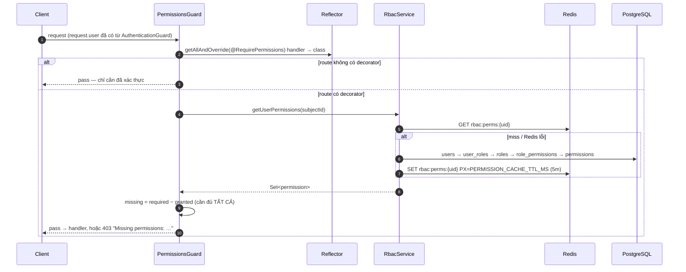
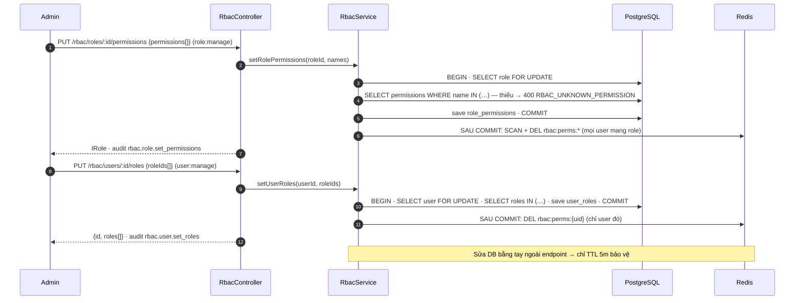

# RBAC động (permission-based)

> Trạng thái: **Implemented** — guard, cache Redis, và endpoint quản trị role/permission.
> Không có teams/phòng ban/leader theo yêu cầu dự án.

## Endpoint quản trị (`/api/v1/rbac`)

| Method | Route | Permission | Audit action | Invalidate |
|---|---|---|---|---|
| GET | `/rbac/roles` | `role:read` | — | — |
| GET | `/rbac/permissions` | `role:read` | — | — |
| PUT | `/rbac/roles/:id/permissions` | `role:manage` | `rbac.role.set_permissions` | `invalidateAll()` — mọi user mang role |
| PUT | `/rbac/users/:id/roles` | `user:manage` | `rbac.user.set_roles` | `invalidateUser(id)` |

Body thay toàn bộ (`permissions: string[]` theo tên; `roleIds: uuid[]`). Permission/role không tồn tại → `400 RBAC_UNKNOWN_PERMISSION` / `RBAC_UNKNOWN_ROLE` kèm `details.missing`, không ghi gì. Row role/user được `FOR UPDATE` trong transaction; invalidate chạy **sau commit** (cache-aside: DB trước, DEL sau). Đây là điểm mutation duy nhất của `role_permissions`/`user_roles` qua HTTP — xem rule tại `coding-rules.md` §5.

## Nguyên tắc
Roles và permissions là **data trong DB**, admin tạo/sửa runtime. Code chỉ biết chuỗi permission dạng `resource:action` (vd `story:create`, `user:ban`), không hardcode enum role.

## Schema DB (5 bảng)
```
users(id, ...)
roles(id, name, description)
permissions(id, name)              -- "resource:action"
role_permissions(role_id, permission_id)
user_roles(user_id, role_id)
```

## Luồng hoạt động

### Kiểm tra quyền mỗi request (giống nhau ở cả hai `AUTH_MODE`)



### Admin đổi quyền → invalidate sau commit



Sơ đồ chỉnh sửa được: page *Auth · Authorization (RBAC)* trong `docs/diagrams/backend-architecture.drawio`.

## Cơ chế
- Decorator `@RequirePermissions('story:create')` dùng `SetMetadata`.
- `PermissionsGuard` chạy sau `AuthenticationGuard`: đọc `AuthPrincipal` và metadata qua `Reflector`, load tập permission của user, rồi so khớp.
- **Cache** tập permission theo `user_id` trong Redis (`rbac:perms:{userId}`, TTL `PERMISSION_CACHE_TTL_MS` = 5 phút), fail-open về DB khi Redis lỗi; invalidate qua hai endpoint ở trên. Sửa DB bằng tay ngoài endpoint thì chỉ TTL bảo vệ.
- KHÔNG nhét toàn bộ permissions vào JWT payload (token phình + không revoke được khi đổi quyền giữa chừng).

## CASL vs custom guard — kết luận
| | Custom PermissionsGuard | CASL |
|---|---|---|
| Độ phức tạp | Thấp (~100 dòng) | Phải học ability/subject/conditions |
| Kiểu kiểm soát | resource:action phẳng | RBAC + ABAC (điều kiện thuộc tính) |
| Query-level filter | Tự viết | Có sẵn |

**Chọn: custom PermissionsGuard.** CASL chỉ đáng khi cần ownership/điều kiện phức tạp; ownership đơn giản ("bài của tôi") check bằng `if (entity.authorId !== user.id)` trong service là đủ. Permission string `resource:action` mở rộng dần không cần đổi schema.

## Nguồn tham khảo
- https://medium.com/@kathishcivil94/demystifying-access-control-rbac-vs-casl-in-nestjs-e1cde782e5c0
- https://medium.com/yavar/casl-roles-with-persisted-permissions-in-nestjs-152129f4a6fb
- https://dev.to/imzihad21/custom-role-based-access-control-in-nestjs-using-custom-guards-jol
- https://github.com/nrprosper/nest-casl-rbac
- https://dev.to/emann/abac-and-casl-with-nestjs-3d6c
