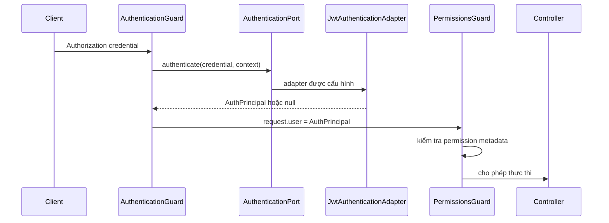
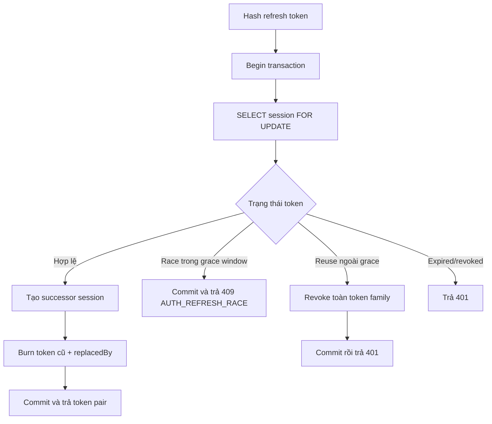

# Cấu trúc MeagoServer

Tài liệu này mô tả modular monolith hiện tại và ranh giới cần giữ khi mở rộng. Nó là bản đồ triển khai, không phải sơ đồ kiến trúc lý tưởng chưa có trong code.

> Bản trình bày trực quan có thể chỉnh sửa bằng diagrams.net: [backend-architecture.drawio](../diagrams/backend-architecture.drawio).

Quy ước sơ đồ: đường liền biểu diễn dependency/adapter đang triển khai; đường nét đứt tới `@meago/core` là contract dependency; `SESSION ADAPTER` nét đứt là lựa chọn đã thiết kế nhưng **chưa được wire** trong MeagoServer hiện tại. JWT adapter là implementation đang active. Thay boundary hoặc trạng thái implementation phải cập nhật cả file này và source draw.io.

## Bản đồ thư mục

```text
src/
├─ common/
│  ├─ abstracts/         # Base service/entity behavior dùng nội bộ NestJS
│  ├─ auth/              # AuthenticationPort và injection token
│  ├─ decorators/        # @Public, @CurrentUser, @RequirePermissions
│  ├─ dto/               # DTO transport dùng chung phía Server
│  ├─ filters/           # Chuẩn hóa lỗi HTTP/TypeORM
│  ├─ guards/            # AuthenticationGuard, PermissionsGuard
│  ├─ interceptors/      # Chuẩn hóa success response
│  └─ middlewares/       # Cross-cutting HTTP middleware
├─ configs/              # Typed config và env validation
├─ database/             # DataSource, migration, seed
├─ libraries/
│  └─ redis/             # Redis adapter dùng chung
├─ modules/
│  ├─ auth/              # Login, refresh, logout, JWT adapter
│  ├─ users/             # User domain
│  ├─ rbac/              # Role và permission domain
│  └─ health/            # Health checks
├─ app.module.ts         # Composition root
└─ main.ts               # HTTP bootstrap
```

## Ranh giới kiến trúc

Password hashing đi qua `PasswordHasher`. `AuthService` không import thư viện hash cụ thể; `Argon2PasswordHasher` là adapter mặc định và dùng Argon2id. Adapter nằm trong `src/common/security`, không export qua `@meago/core` vì đây là security implementation riêng của Server.

```mermaid
flowchart TB
    HTTP[Controller / Guard / Filter]
    APP[Application services]
    DOMAIN[Domain rules and entities]
    PORT[Ports / contracts]
    ADAPTER[JWT, TypeORM, Redis adapters]
    CORE[@meago/core]
    INFRA[(PostgreSQL / Redis)]

    HTTP --> APP
    APP --> DOMAIN
    APP --> PORT
    HTTP --> CORE
    APP --> CORE
    ADAPTER --> PORT
    ADAPTER --> CORE
    ADAPTER --> INFRA

    PORT -. dependency inversion .-> ADAPTER
```

`app.module.ts` là composition root chịu trách nhiệm gắn port với adapter. Core không được import NestJS, TypeORM, Redis hoặc entity database.

## Luồng authentication



Khi dự án chọn session thay JWT, thêm `SessionAuthenticationAdapter` triển khai cùng port và thay binding tại composition root; controller, decorator và permission guard không đổi.

## Luồng refresh rotation



## Quy tắc module

| Thành phần | Trách nhiệm | Không được làm |
|---|---|---|
| Controller | HTTP mapping, validation, cookie | Chứa transaction hoặc domain rule |
| Application service | Điều phối use case và transaction | Phụ thuộc response/UI của Client |
| Entity/domain | State và invariant | Export làm public contract FE |
| Port | Khả năng framework-neutral | Import adapter cụ thể |
| Adapter | JWT, database, cache implementation | Làm thay business use case |
| `@meago/core` | Contract và primitive tái sử dụng | Chứa NestJS/TypeORM hoặc domain Meago riêng |

## Mẫu thêm domain

```text
src/modules/<domain>/
├─ <domain>.entity.ts
├─ <domain>.dto.ts
├─ <domain>.service.ts
├─ <domain>.controller.ts
├─ <domain>.module.ts
└─ *.spec.ts
```

Module khác giao tiếp qua service/port được export, không truy cập repository hoặc entity nội bộ của nhau. Use case nhiều module phải đặt transaction boundary tại service điều phối và truyền `EntityManager` rõ ràng.

Quy tắc optimistic/pessimistic lock và transaction foundation được mô tả tại [Transaction và concurrency control](concurrency.md).
