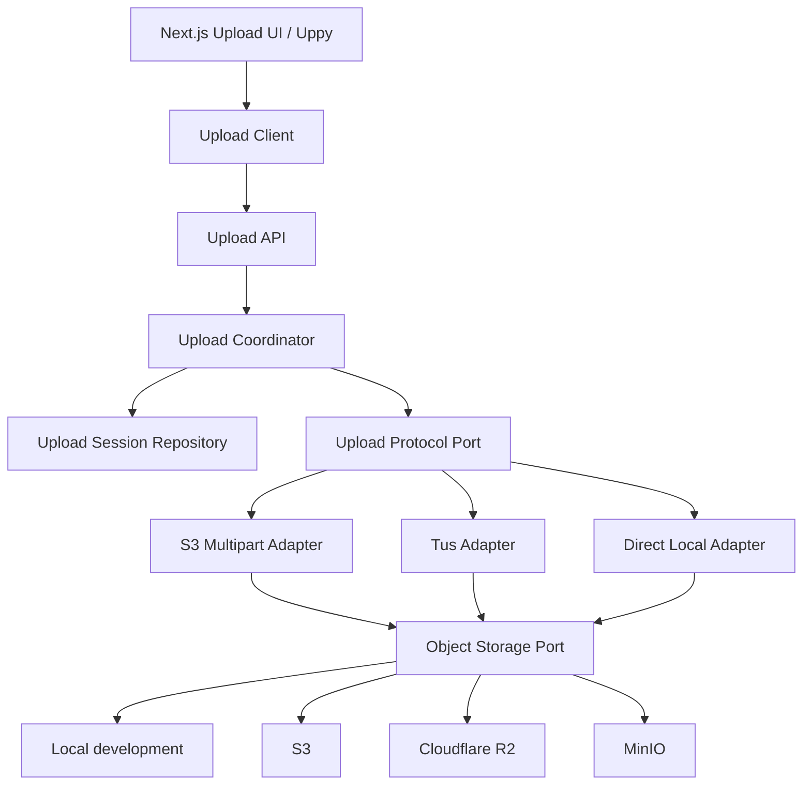

# Kiến trúc upload

Trạng thái: **Core contracts implemented; adapters not selected** — 2026-08-31.

## Quyết định

Upload UI, upload protocol và object storage là ba boundary khác nhau:



Uppy không được xuất hiện trong BE core. AWS SDK, Tus server hoặc filesystem cũng không được import vào `uploads/core`.

## State machine

```text
initiated → uploading → uploaded → processing → ready
    │           │           │           │
    ├───────────┴───────────┴───────────┴──→ failed
    └──────────→ aborted ←──┘
```

`ready`, `failed`, `aborted` là terminal state. Transition không hợp lệ phải bị từ chối trong domain trước khi gọi storage.

## Core đã triển khai

- `UploadSessionRecord`: metadata và lifecycle trung lập persistence.
- `UploadProtocolPort`: initiate/complete/abort.
- `ObjectStoragePort`: inspect/delete/create read URL.
- `UploadSessionRepository`: persistence boundary.
- `UploadCoordinator`: policy, ownership, object key, idempotent completion/abort.
- Object key do Server sinh từ owner/session ID; không dùng filename từ client.
- Policy kiểm tra positive safe integer, max size và content-type allowlist trước khi gọi adapter.

Content-Type client chỉ là kiểm tra sớm. Adapter/finalization phải kiểm tra kích thước thật và magic bytes trước khi chuyển `uploaded` sang `processing` hoặc `ready`.

## Lựa chọn deployment

### Development

Direct local adapter được phép để phát triển nhanh, có giới hạn file nhỏ. Không dùng local filesystem cho multi-replica production.

### Production mặc định

S3-compatible multipart là lựa chọn ưu tiên cho S3, R2 và MinIO:

```text
Client → API: initiate
API → Client: uploadId + signed part URLs
Client → Object storage: upload parts trực tiếp
Client → API: complete
API → Provider: complete + inspect
API → DB: uploaded
API → Queue: scan/probe/transcode
```

Bytes không đi xuyên qua NestJS. S3/R2/MinIO dùng một adapter family nhưng vẫn phải có contract tests theo từng provider vì mức tương thích multipart không được giả định tuyệt đối.

### Tus

Chỉ thêm khi cần resumable provider-neutral hoặc chạy `tusd`. Không bật đồng thời Tus và S3 multipart cho cùng một upload session.

## Schema persistence dự kiến

Entity/migration phase sau phải lưu tối thiểu session ID, owner ID, object key, protocol, provider upload ID, expected metadata, status, failure code, checksum và verified metadata. Không lưu presigned URL vì URL là credential ngắn hạn.

## Gate trước khi expose controller

- TypeORM migration up/down và repository contract tests.
- Adapter contract test: initiate, resume/list parts, complete, abort, inspect.
- Ownership/permission và quota test.
- Idempotency/concurrency test cho complete/abort.
- Magic-byte, size và checksum verification.
- Cleanup job cho initiated/uploading session hết hạn và orphan multipart.
- Rate limit theo user; audit log không chứa signed URL.
